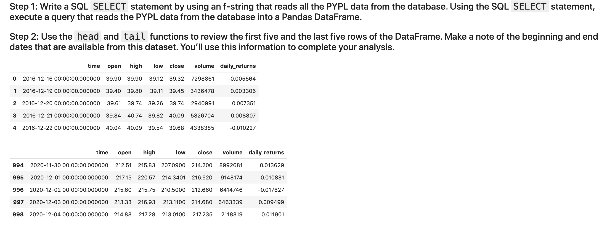
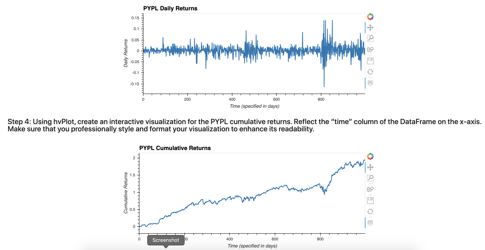
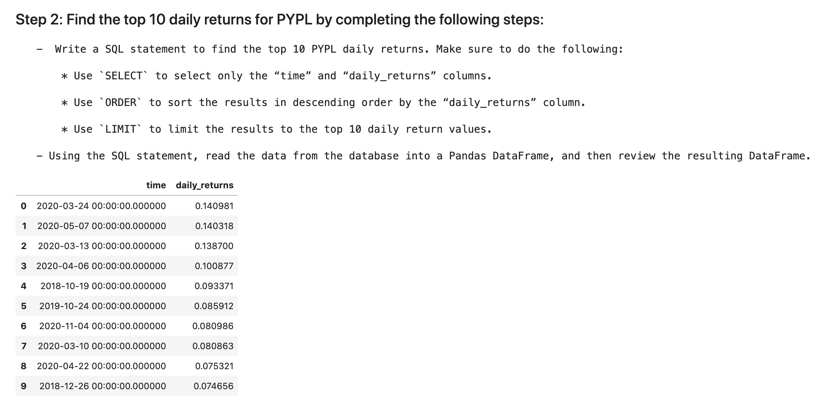
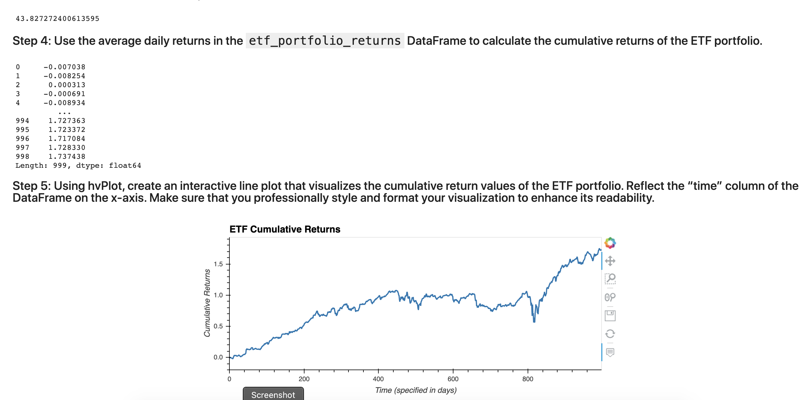

# Web Application for ETF Analyzer

In recent years, finance has had an explosion in passive investing. Passive investing means that you invest in a basket of assets that’s called an exchange-traded fund (ETF). This way, you don’t spend time researching individual stocks or companies or take the risk of investing in a single stock. Unless you're Warren Buffet, ETFs can be beneficial to you, as they offer more diversification.

You will build a financial database and web application by using SQL, Python, and the Voilà library to analyze the performance of a hypothetical fintech ETF.

---

## Technologies

This project leverages python 3.7 with the following packages:

* [SQLAlchemy](https://www.sqlalchemy.org/) - An open-source SQL library for Python. It’s designed to ease the communication between Python-based programs and databases.

* [Voilà](https://voila.readthedocs.io/en/stable/using.html) - A Python library which allows you to convert a Jupyter notebook into a live webpage.

---

## Installation Guide

The SQLAlchemy library should have installed on your computer as part of the Anaconda download.

To confirm that SQLAlchemy installed in your Conda dev environment, open a terminal window, and then complete the following steps:
    
	conda list sqlalchemy
    
To install Voilà, open a terminal window, and then complete the following steps:

Activate your Conda dev environment.

Run the following command:

    conda install -c conda-forge voila

---

## Usage

Analyze the daily returns of the ETF stocks both individually and as a whole. Then deploy the visualizations to a web application by using the Voilà library.

The detailed instructions are divided into the following parts:

1) Analyze a single asset in the ETF

2) Optimize data access with advanced SQL queries

3) Analyze the ETF portfolio

4) Deploy the notebook as a web application

### The final outcome should result in the following:

- A Jupyter notebook with your analysis of the ETF data that a SQL database stores

- Professionally styled and formatted interactive visualizations

- Sample screenshots of the web application that you created by deploying your Jupyter notebook via the Voilà library

---

## Contributors

Brought to you by Edgar Coronado

---

## License

MIT